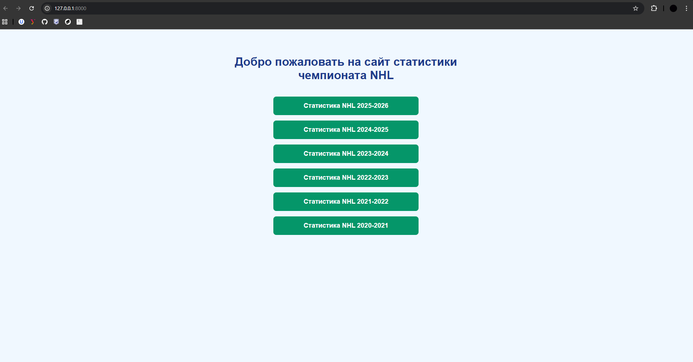
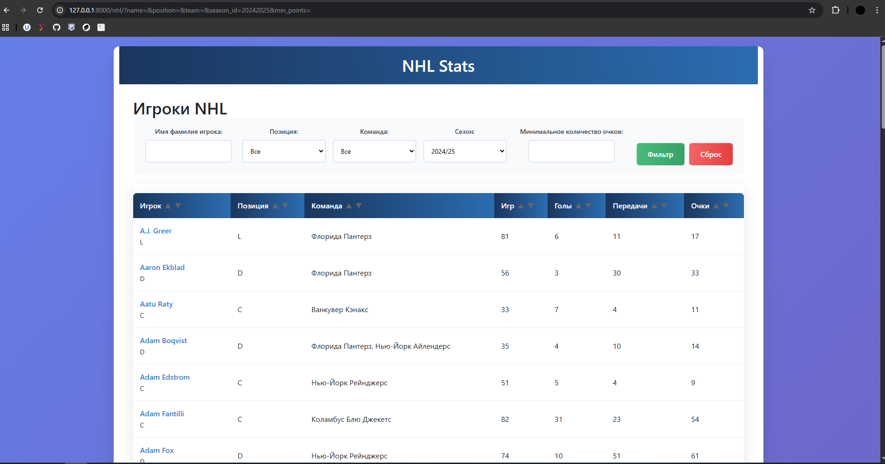
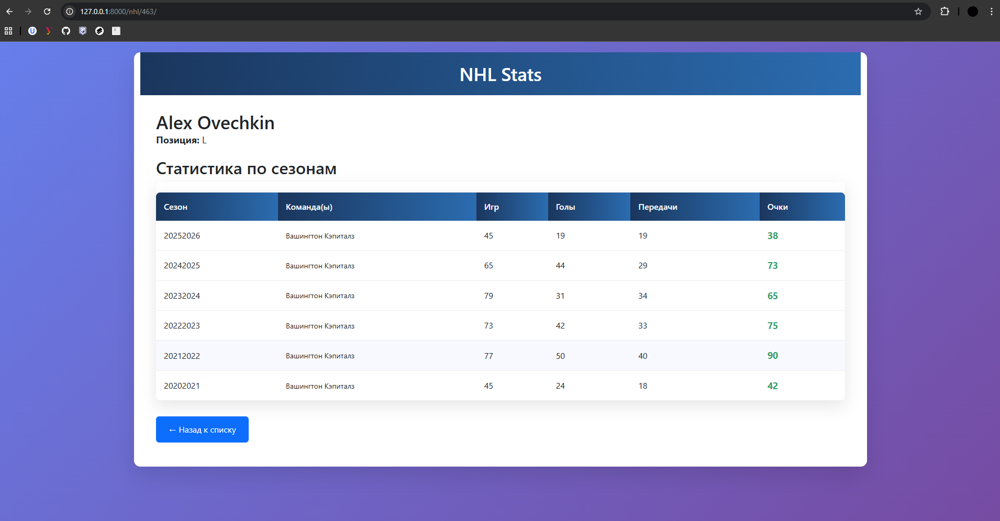

# NHL Stats Tracker

**NHL Stats Tracker** — веб‑сервис статистики игроков НХЛ для болельщиков с целью аналитики сезонов по командам и метрикам. Сервис показывает ключевые метрики (голы, передачи, очки, время на льду), поддерживает мощную фильтрацию по командам/позициям и сортировку по любой статистике. Данные обновляются из официального NHL API.

**Ссылка на рабочий проект:** [https://todo.pythonanywhere.com](https://todo.pythonanywhere.com)

## Технологии

**Backend:**
- Python 3.11+
- Django 6.0
- SQLite (Dev) / PostgreSQL (Prod)
- requests 2.32.5 (работа с NHL API)

**Данные и аналитика:**
- NHL API (https://api.nhle.com/stats/rest/en/skater/summary)
- Постраничная загрузка статистики
- Расчет производных метрик (очки/матч, рейтинг)

**Frontend:**
- Bootstrap 5.3
- DataTables.js (интерактивные таблицы)
- HTMX (динамические фильтры)

**Зависимости проекта:**

- Django==6.0
- requests==2.32.5
- asgiref==3.11.0
- sqlparse==0.5.4
- tzdata==2025.2


## Демо интерфейса

### 1. Главная страница — выбор сезона для просмотра статистики

*Пользователь должен выбрать сезон, в котором он хочет посмотреть статистику всех игроков*

### 2. Статистика конкретного сезона

*Пользаватель видит статистику всех игроков за выбранный сезон, может применить фильтры, отсортировать игроков по метрикам или перейти на детальную страницу конкретного игрока*

### 3. Детальная статистика игрока

*Пользователь видит статистику выбранного игрока за последние 6 сезонов*

## Как запустить проект локально

1. **Клонируйте репозиторий:**
   ```bash
   git clone https://github.com/zikitos888/NHL-Stats-Tracker.git
   cd nhl-stats-tracker
   ```
2. **Создайте и активируйте виртуальное окружение:**
   ```bash
   python -m venv venv
   source venv/bin/activate  # для Linux/Mac
   venv\Scripts\activate     # для Windows
   ```
3. **Установите зависимости:**
   ```bash
   pip install -r requirements.txt
   ```
4. **Выполните миграции:**
   ```bash
   python manage.py migrate
   python manage.py load_nhl_data 20252026 # Загрузка команд и статистики
   python manage.py load_nhl_data 20242025
   python manage.py load_nhl_data 20232024
   python manage.py load_nhl_data 20222023
   python manage.py load_nhl_data 20212022
   python manage.py load_nhl_data 20202021
   ```
5. **Создайте суперпользователя**
   ```bash
   python manage.py createsuperuser
   ```
6. **Запустите сервер:**
   ```bash
   python manage.py runserver
   ```
7. **Откройте проект в браузере:**
Перейдите по ссылке: http://127.0.0.1:8000/